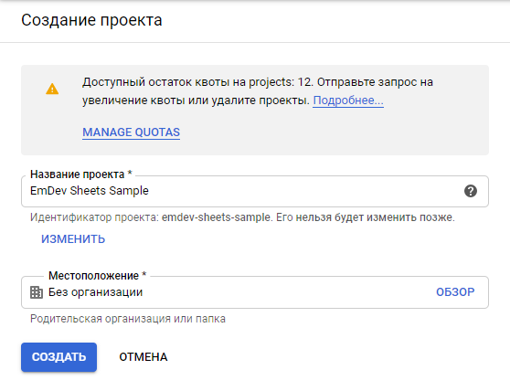
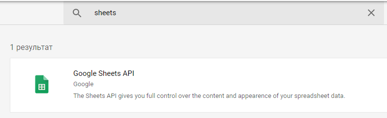
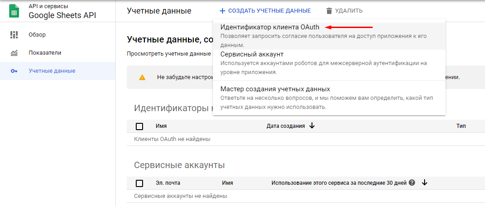
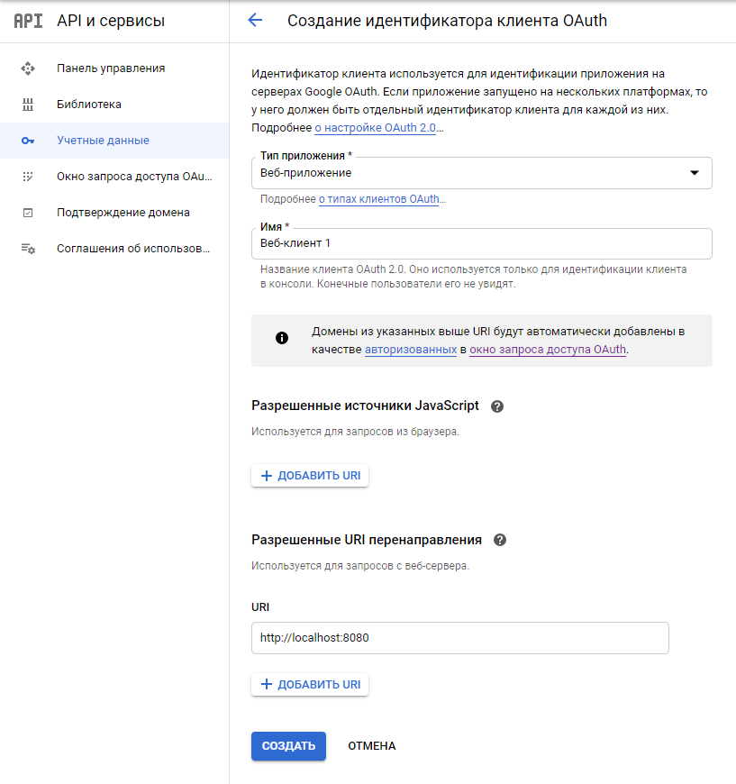
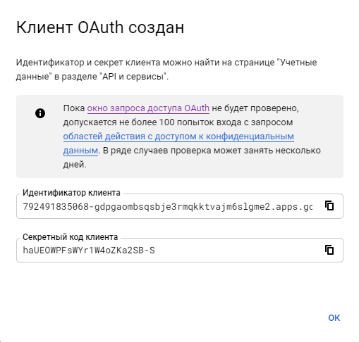
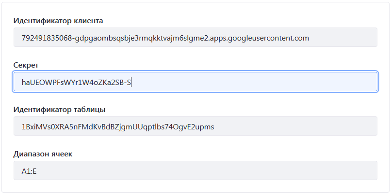

# Пример работы с Google документами

## Сборка проекта

Выполнить:
```
./gradlew clean deploy
```

## Deploy
Задеплоить полученный артефакт на портал через: Панель управления - Приложения - Менеджер приложений.

## Создание учетных данных для работы с Google API

### Создать Google-приложение
Создать новый проект через [google консоль](https://console.developers.google.com/)



### Подключить Google Sheets API

Добавляем API для работы с Google таблицами:


### Создать учетные данные

Нужно добавить идентификатор клиента OAuth


Создаем идентификатор клиента OAuth:


Получаем идентификатор клиента и секрет:


## Настроить портлет

Зайти в конфигурацию портлета и настроить параметры:

- Идентификатор клиента: clientId.apps.googleusercontent.com
- Секрет: secretId
- Идентификатор таблицы: (https://docs.google.com/spreadsheets/d/{tableId})
- Диапазон ячеек: A1:F



